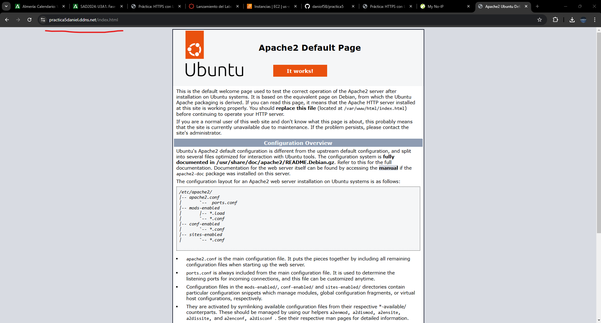

# Practica 5
# HTTPS con Let’s Encrypt y Certbot
En esta guía, he configurado un subdominio usando DNS dinámico para permitir el acceso a un servidor con IP dinámica mediante un nombre de dominio fijo

## Estructura 
``` bash
.
│ 
├── conf
│   ├── 000-default.conf
│   └── default-ssl.conf
└── scripts
    ├── .env
    ├── install_lamp.sh
    └── setup_letsencrypt_certificate.sh

```


## Guia  de 000-default.conf

``` bash
# Desactiva la firma del servidor
ServerSignature Off

# Configura Apache 
ServerTokens Prod

<VirtualHost *:80>
    # Define el email del administrador 
    #ServerAdmin webmaster@localhost

    # Establece el directorio raíz del sitio web
    DocumentRoot /var/www/html

    # Especifica el orden de preferencia 
    DirectoryIndex index.php index.html

    # Define el archivo de registro para los errores
    ErrorLog ${APACHE_LOG_DIR}/error.log

    # Configura el archivo de registro para registrar todos los accesos al servidor
    CustomLog ${APACHE_LOG_DIR}/access.log combined
</VirtualHost>
```
## Guia de default-ssl.conf
``` bash
<VirtualHost *:443>
    # Define el nombre del servidor
    #ServerName practica-https.local

    # Define el directorio raíz
    DocumentRoot /var/www/html

    # Define el orden de los archivos
    DirectoryIndex index.php index.html

    # Habilita el uso de SSL para este VirtualHost
    SSLEngine on

    # Especifica la ruta al archivo del certificado SSL 
    SSLCertificateFile /etc/ssl/certs/apache-selfsigned.crt

    # Define la ruta a la clave privada del certificado SSL
    SSLCertificateKeyFile /etc/ssl/private/apache-selfsigned.key
</VirtualHost>

```

## Guia de .env

``` bash
# Dirección de correo electrónico asociada al certificado SSL
CERTIFICATE_EMAIL=demo@demo.es

# Dominio para el cual se generará el certificado SSL
CERTIFICATE_DOMAIN=practica5daniel.ddns.net
```

## Guia del install_lamp.sh
``` bash
#!/bin/bash

# Muestra todos los comandos que se han ejecutado 
set -ex

# Actualización de los repositorios 
apt update

# Actualización de paquetes
# sudo apt upgrade  

# Instalación del servidor web Apache
apt install apache2 -y

# Instalación del servidor de base de datos MySQL
apt install mysql-server -y

# Instalación de PHP junto Apache y MySQL
apt install php libapache2-mod-php php-mysql -y

# Reinicio del servicio Apache
systemctl restart apache2

# Cambia el propietario y el grupo del directorio /var/www/html a www-data
chown -R www-data:www-data /var/www/html
``` 

# Creación del dominio
Hay que crear un dominio asociado a una ip publica, para ello he utilizado no ip, el cual aporta este tipo de cosas de forma gratuita

Tenemos que asignar la ip publica a dicho dominio, y tiene que ser la ip de la máquina con la que se este trabajando

[Pagina de NOIP](https://www.noip.com) 


## Guia setup_letsencrypt_certificate.sh
``` bash
#!/bin/bash

# Muestra todos los comandos que se han ejecutado 
set -ex

# Actualización de los repositorios 
apt update

# Actualización de paquetes
# sudo apt upgrade

# Importamos el archivo de variables .env
source .env

# Instalación de snap y actualización de la versión instalada de snap
snap install core
snap refresh core

# Elimina cualquier instalación previa de certbot 
apt remove certbot

# Instalación de la aplicación certbot 
snap install --classic certbot

# Creamos un alias para certbot
ln -sf /snap/bin/certbot /usr/bin/certbot

# Obtenemos el certificado SSL de Let's Encrypt para el dominio especificado en .env
certbot --apache -m $CERTIFICATE_EMAIL --agree-tos --no-eff-email -d $CERTIFICATE_DOMAIN --non-interactive

``` 

## Explicación 
### 000-default.conf:
 Configura el servidor Apache para servir contenido en el puerto 80 y define el directorio raíz

### default-ssl.conf: 
Configura Apache para habilitar HTTPS en el puerto 443 usando SSL. Define las rutas del certificado y la clave SSL para asegurar la comunicación

### .env:
 Contiene las variables de configuración necesarias para generar el certificado SSL, como el correo y el dominio asociado

### install_lamp.sh: 
Instala el stack LAMP en el servidor actualiza los repositorios y ajusta los permisos para los archivos del servidor web

### setup_letsencrypt_certificate.sh: 
Instala Certbot y configura el servidor Apache para obtener un certificado SSL de Let's Encrypt asegurando el sitio con HTTPS

# Comprobación

